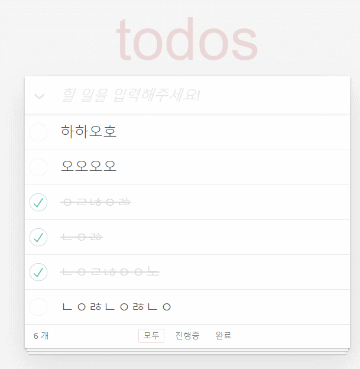

# 🗒️ TodoApp
자바스크립트로 구현하는 투두리스트
 

## 🔥 결과물

    

  <a href="https://dalcon10028.github.io/Tutoring21-2-TodoApp/">🖥️ DEMO</a>

 

## 🎯 요구사항

- [ ]  todo list에 todoItem을 키보드로 입력하여 추가하기
- [ ]  todo list의 체크박스를 클릭하여 complete 상태로 변경 (li tag 에 completed class 추가, input 태그에 checked 속성 추가)
- [ ]  todo list를 더블클릭했을 때 input 모드로 변경
- [ ]  todo list의 item갯수를 count한 갯수를 리스트의 하단에 보여주기
- [ ]  todo list의 상태값을 확인하여, 해야할 일과, 완료한 일을 클릭하면 해당 상태의 아이템만 보여주기